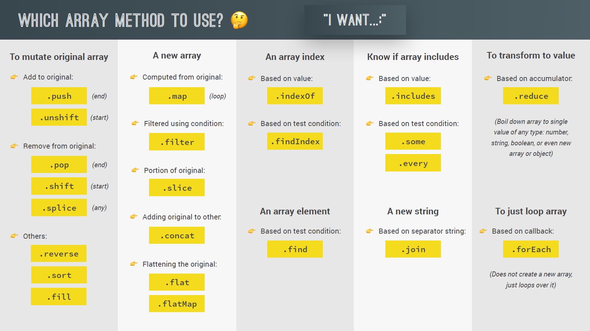

#### ** Which array method to use **

| Método         | Descripción                                                                                                                                                                                                                                                                                             | MDN Link                                                                                                          |
| -------------- | ------------------------------------------------------------------------------------------------------------------------------------------------------------------------------------------------------------------------------------------------------------------------------------------------------- | ----------------------------------------------------------------------------------------------------------------- |
| at             | El método `at()` recibe un valor numérico entero y devuelve el elemento en esa posición, permitiendo valores positivos y negativos. Los valores negativos contarán desde el último elemento del array.                                                                                                  | _[Ver más](https://developer.mozilla.org/es/docs/Web/JavaScript/Reference/Global_Objects/Array/at )_              |
| concat         | El método `concat()` se usa para unir dos o más arrays. Este método no cambia los arrays existentes, sino que devuelve un nuevo array.                                                                                                                                                                  | _[Ver más](https://developer.mozilla.org/es/docs/Web/JavaScript/Reference/Global_Objects/Array/concat)_           |
| copyWithin     | El método `copyWithin()` transfiere una copia plana de una sección a otra dentro del mismo array ( o contexto similar ), sin modificar su propiedad length y lo devuelve.                                                                                                                               | _[Ver más](https://developer.mozilla.org/es/docs/Web/JavaScript/Reference/Global_Objects/Array/copyWithin )_      |
| entries        | El método `entries()` retorna un nuevo objeto Array Iterator que contiene los pares clave/valor para cada índice de la matriz.                                                                                                                                                                          | _[Ver más](https://developer.mozilla.org/es/docs/Web/JavaScript/Reference/Global_Objects/Array/entries )_         |
| every          | El método `every()` determina si todos los elementos en el array satisfacen una condición.                                                                                                                                                                                                              | _[Ver más](https://developer.mozilla.org/es/docs/Web/JavaScript/Reference/Global_Objects/Array/every )_           |
| fill           | El método `fill()` cambia todos los elementos en un arreglo por un valor estático, desde el índice start (por defecto 0) hasta el índice end (por defecto array.length). Devuelve el arreglo modificado.                                                                                                | _[Ver más](https://developer.mozilla.org/es/docs/Web/JavaScript/Reference/Global_Objects/Array/filter )_          |
| filter         | El método `filter()` crea un nuevo array con todos los elementos que cumplan la condición implementada por la función dada.                                                                                                                                                                             | _[Ver más](https://developer.mozilla.org/es/docs/Web/JavaScript/Reference/Global_Objects/Array/at )_              |
| find           | El método `find()` devuelve el valor del primer elemento del array que cumple la función de prueba proporcionada.                                                                                                                                                                                       | _[Ver más](https://developer.mozilla.org/es/docs/Web/JavaScript/Reference/Global_Objects/Array/find )_            |
| findIndex      | El método `findIndex()` devuelve el índice del primer elemento de un array que cumpla con la función de prueba proporcionada. En caso contrario devuelve -1.                                                                                                                                            | _[Ver más](https://developer.mozilla.org/es/docs/Web/JavaScript/Reference/Global_Objects/Array/findIndex )_       |
| findLast       | El método `findLast()` devuelve el valor del último elemento de un array que cumpla con la función de prueba proporcionada, si ningún elemento cumple con el criterio devuelve `undefined`.                                                                                                             | _[Ver más](https://developer.mozilla.org/en-US/docs/Web/JavaScript/Reference/Global_Objects/Array/findLast)_      |
| findLastIndex  | El método `findLastIndex()` devuelve el índice del último elemento de un array que cumpla con la función de prueba proporcionada, si ningún elemento cumple con el criterio devuelve -1.                                                                                                                | _[Ver más](https://developer.mozilla.org/en-US/docs/Web/JavaScript/Reference/Global_Objects/Array/findLastIndex)_ |
| flat     🧪     | El método `flat()` crea una nueva matriz con todos los elementos de sub-array concatenados recursivamente hasta la profundidad especificada.                                                                                                                                                            | _[Ver más](https://developer.mozilla.org/es/docs/Web/JavaScript/Reference/Global_Objects/Array/flat)_             |
| flatMap    🧪   | El método `flatMap()` primero mapea cada elemento usando una función de mapeo, luego aplana el resultado en una nueva matriz. Es idéntico a un map seguido de un flatten (en-US)de profundidad 1, pero flatMap es a menudo útil y la fusión de ambos en un método es ligeramente más eficiente.         | _[Ver más](https://developer.mozilla.org/es/docs/Web/JavaScript/Reference/Global_Objects/Array/flatMap )_         |
| forEach        | El método `forEach()` ejecuta la función indicada una vez por cada elemento del array.                                                                                                                                                                                                                  | _[Ver más](https://developer.mozilla.org/es/docs/Web/JavaScript/Reference/Global_Objects/Array/forEach )_         |
| from           | El método `Array.from()` crea una nueva instancia de Array a partir de un objeto iterable.                                                                                                                                                                                                              | _[Ver más](https://developer.mozilla.org/es/docs/Web/JavaScript/Reference/Global_Objects/Array/from)_             |
| includes       | El método `includes()` determina si una matriz incluye un determinado elemento, devuelve `true` o `false` según corresponda.                                                                                                                                                                            | _[Ver más](https://developer.mozilla.org/es/docs/Web/JavaScript/Reference/Global_Objects/Array/includes )_        |
| indexOf        | El método `indexOf()` retorna el primer índice en el que se puede encontrar un elemento dado en el array, ó retorna -1 si el elemento no esta presente.                                                                                                                                                 | _[Ver más](https://developer.mozilla.org/es/docs/Web/JavaScript/Reference/Global_Objects/Array/indexOf )_         |
| isArray        | El método isArray() determina si el valor pasado es un Array.                                                                                                                                                                                                                                           | _[Ver más](https://developer.mozilla.org/es/docs/Web/JavaScript/Reference/Global_Objects/Array/isArray )_         |
| join           | El método `join()` une todos los elementos de una matriz (o un objeto similar a una matriz) en una cadena y devuelve esta cadena.                                                                                                                                                                       | _[Ver más](https://developer.mozilla.org/es/docs/Web/JavaScript/Reference/Global_Objects/Array/join )_            |
| keys           | El método `keys()` devuelve un nuevo objeto Array Iterator que contiene las claves de índice con las que acceder a cada elemento en el array.                                                                                                                                                           | _[Ver más](https://developer.mozilla.org/es/docs/Web/JavaScript/Reference/Global_Objects/Array/keys )_            |
| lastIndexOf    | El método `lastIndexOf()` devuelve el último índice en el que un cierto elemento puede encontrarse en el arreglo, ó -1 si el elemento no se encontrara. El arreglo es recorrido en sentido contrario, empezando por el índice fromIndex.                                                                | _[Ver más](https://developer.mozilla.org/es/docs/Web/JavaScript/Reference/Global_Objects/Array/lastIndexOf )_     |
| map            | El método `map()` crea un nuevo array con los resultados de la llamada a la función indicada aplicados a cada uno de sus elementos.                                                                                                                                                                     | _[Ver más](https://developer.mozilla.org/es/docs/Web/JavaScript/Reference/Global_Objects/Array/map )_             |
| of             | El método `Array.of()` crea una nueva instancia Array con un número variable de elementos pasados como argumento, independientemente del número o del tipo.                                                                                                                                             | _[Ver más](https://developer.mozilla.org/es/docs/Web/JavaScript/Reference/Global_Objects/Array/of )_              |
| pop            | El método `pop()` elimina el último elemento de un array y lo devuelve. Este método cambia la longitud del array.                                                                                                                                                                                       | _[Ver más](https://developer.mozilla.org/es/docs/Web/JavaScript/Reference/Global_Objects/Array/pop )_             |
| push           | El método `push()` añade uno o más elementos al final de un array y devuelve la nueva longitud del array.                                                                                                                                                                                               | _[Ver más](https://developer.mozilla.org/es/docs/Web/JavaScript/Reference/Global_Objects/Array/push )_            |
| reduce         | El método `reduce()` ejecuta una función reductora sobre cada elemento de un array, devolviendo como resultado un único valor.                                                                                                                                                                          | _[Ver más](https://developer.mozilla.org/es/docs/Web/JavaScript/Reference/Global_Objects/Array/reduce )_          |
| reduceRight    | El método `reduceRight()` Aplica una función simultáneamente contra un acumulador y cada elemento de un array (de derecha a izquierda) para reducirlo a un único valor.                                                                                                                                 | _[Ver más](https://developer.mozilla.org/es/docs/Web/JavaScript/Reference/Global_Objects/Array/reduceRight )_     |
| reverse        | El método `reverse()` invierte el orden de los elementos de un array in place. El primer elemento pasa a ser el último y el último pasa a ser el primero.                                                                                                                                               | _[Ver más](https://developer.mozilla.org/es/docs/Web/JavaScript/Reference/Global_Objects/Array/reverse )_         |
| shift          | El método `shift()` elimina el primer elemento del array y lo retorna. Este método modifica la longitud del array.                                                                                                                                                                                      | _[Ver más](https://developer.mozilla.org/es/docs/Web/JavaScript/Reference/Global_Objects/Array/shift )_           |
| slice          | El método `slice()` devuelve una copia de una parte del array dentro de un nuevo array empezando por inicio hasta fin (fin no incluido). El array original no se modificará.                                                                                                                            | _[Ver más](https://developer.mozilla.org/es/docs/Web/JavaScript/Reference/Global_Objects/Array/slice )_           |
| some           | El método `some()` comprueba si al menos un elemento del array cumple con la condición implementada por la función proporcionada.                                                                                                                                                                       | _[Ver más](https://developer.mozilla.org/es/docs/Web/JavaScript/Reference/Global_Objects/Array/some )_            |
| sort           | El método `sort()` ordena los elementos de un arreglo (array) localmente y devuelve el arreglo ordenado. La ordenación no es necesariamente estable. El modo de ordenación por defecto responde a la posición del valor del string de acuerdo a su valor Unicode.                                       | _[Ver más](https://developer.mozilla.org/es/docs/Web/JavaScript/Reference/Global_Objects/Array/sort )_            |
| splice         | El método `splice()` cambia el contenido de un array eliminando elementos existentes y/o agregando nuevos elementos.                                                                                                                                                                                    | _[Ver más](https://developer.mozilla.org/es/docs/Web/JavaScript/Reference/Global_Objects/Array/splice )_          |
| toLocaleString | El método `toLocaleString()` devuelve una cadena de texto representando los elementos del array. Los elementos son convertidos a texto usando su método toLocaleString y dichos Strings son separados por un caracter específico para la localidad (como una coma para la separación de decimales “,”). | _[Ver más](https://developer.mozilla.org/es/docs/Web/JavaScript/Reference/Global_Objects/Array/toLocaleString )_  |
| toString       | El método `toString()` devuelve una cadena de caracteres representando el array especificado y sus elementos.                                                                                                                                                                                           | _[Ver más](https://developer.mozilla.org/es/docs/Web/JavaScript/Reference/Global_Objects/Array/toString )_        |
| unshift        | El método `unshift()` agrega uno o más elementos al inicio del array, y devuelve la nueva longitud del array.                                                                                                                                                                                           | _[Ver más](https://developer.mozilla.org/es/docs/Web/JavaScript/Reference/Global_Objects/Array/unshift )_         |
| values         | El método `values()` devuelve un nuevo objeto Array Iterator que contiene los valores para cada índice del array.                                                                                                                                                                                       | _[Ver más](https://developer.mozilla.org/es/docs/Web/JavaScript/Reference/Global_Objects/Array/values )_          |
