# JS Notes
## JavaScript Concepts

### **<font color=orangered> JS Engine </font>**

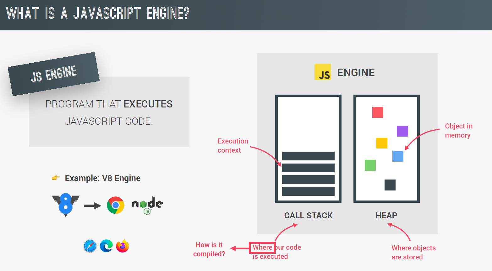

### **<font color=orangered> Execution Context </font>**

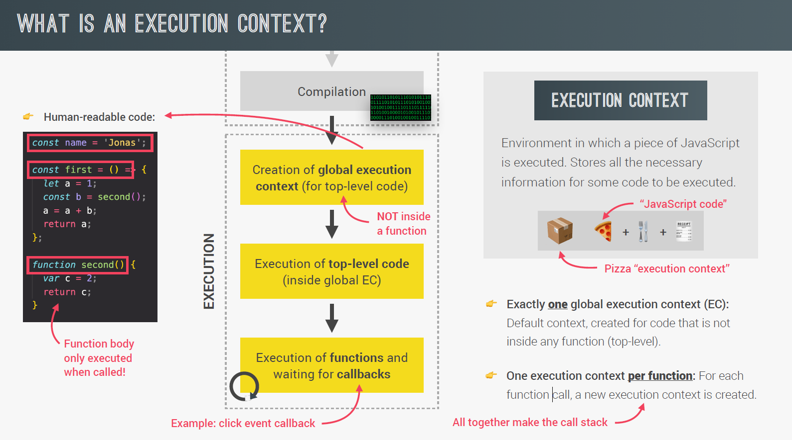
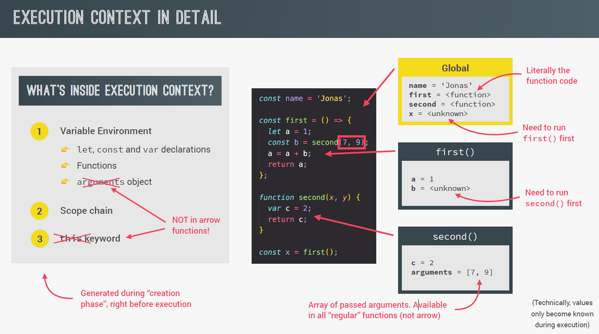


### **<font color=orangered> Scope </font>**

####  **<font color=yellowgreen> Scoping </font>** 
How our program’s variables are organized and accessed. “Where do variables
live?” or “Where can we access a certain variable, and where not?”;
####  **<font color=yellowgreen> Lexical scoping </font>** 
Scoping is controlled by placement of functions and blocks in the code;
####  **<font color=yellowgreen> Scope </font>** 
Space or environment in which a certain variable is declared (variable
environment in case of functions). There is global scope, function scope, and block scope;
####  **<font color=yellowgreen> Scope of a variable </font>** 
Region of our code where a certain variable can be accessed.

### **<font color=orangered> Scope chain </font>**

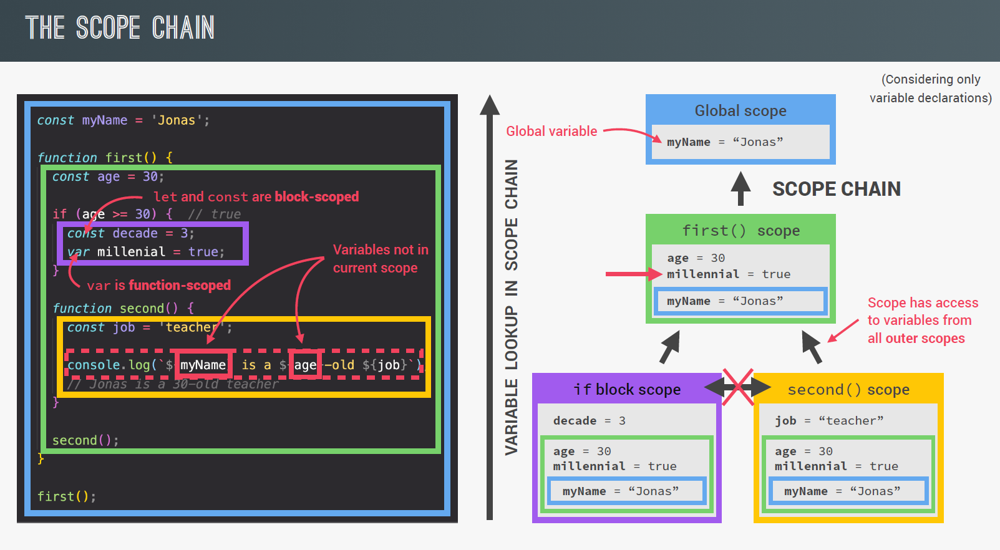

### **<font color=orangered> Scope chain vs Call Stack </font>**

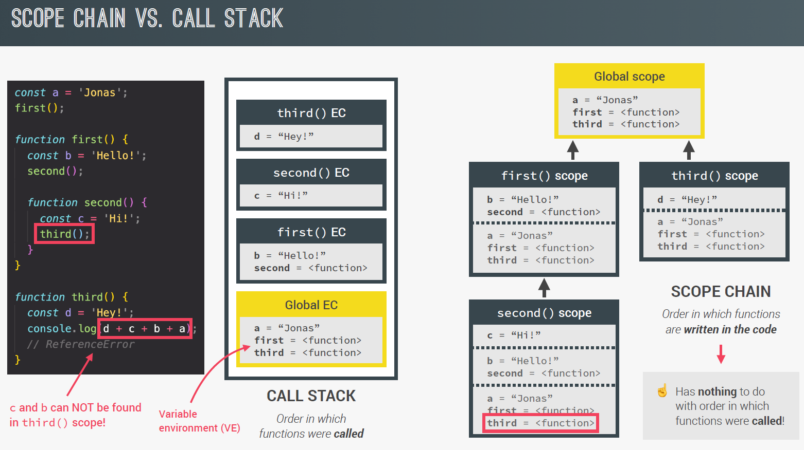

### **<font color=orangered> Hoising and Temporal Dead Zone (TDZ) </font>**

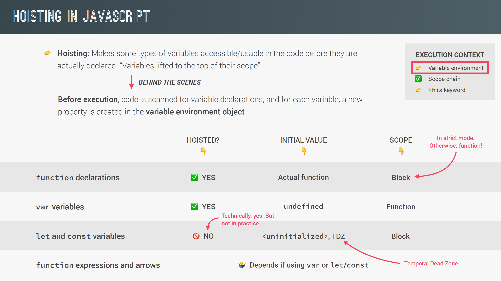
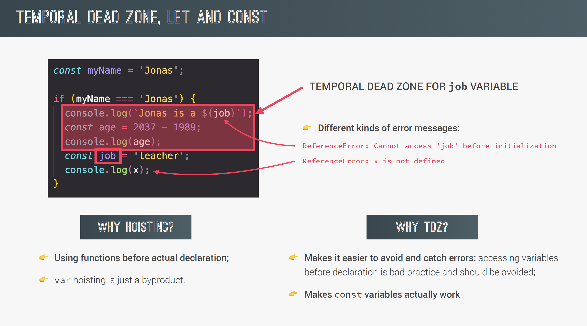


### **<font color=orangered> The `This` keyword  </font>**

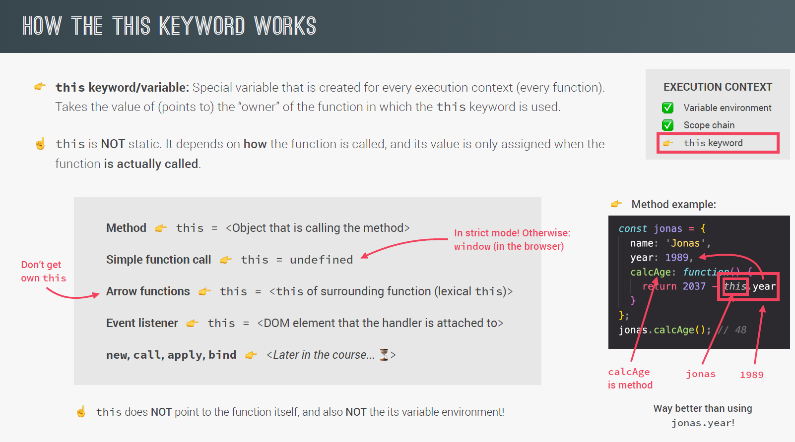

### **<font color=orangered> Store Primitive and Objects </font>**


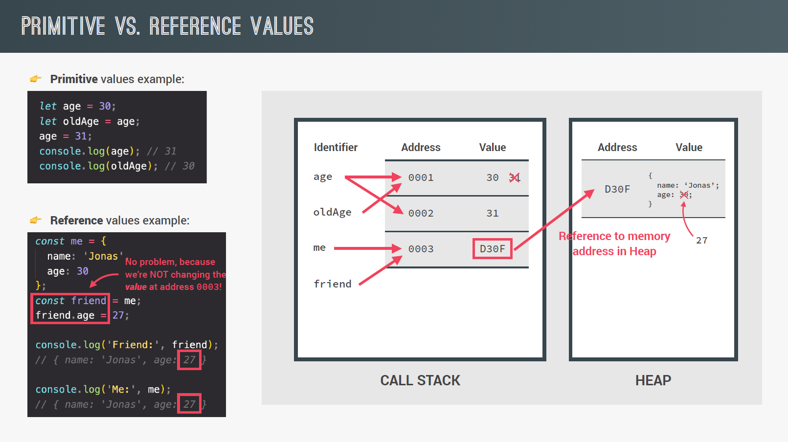

#### **<font color=yellowgreen> HOW TO COPY AN OBJECT  </font>**
To create a copy from one object we can use the `Object.assign()` method. _[Ver más](https://developer.mozilla.org/en-US/docs/Web/JavaScript/Reference/Global_Objects/Object/assign#:~:text=The%20Object.assign()%20method%20only%20copies%20enumerable%20and%20own,copying%20or%20defining%20new%20properties.)_

Other way to copy an object is using spread operator:
```js
const copyObject = ...myObject
```
BUT this methods (`Object.assign()` and Spread operator) are only going to copy the main level properties.


### **<font color=orangered> Mutabilidad  </font>**
Hablamos de mutabilidad en JavaScript (o en otros lenguajes de programación) como la capacidad de un elemento de cambiar su estado. Cambiando el valor de la propiedad de un objeto, o la referencia que tiene una variable, estás haciendo uso de la mutabilidad de estos elementos. _[Ver más](https://www.escuelafrontend.com/articulos/mutabilidad-de-objetos)_

### **<font color=orangered> First Class vs Higher Order Functions  </font>**
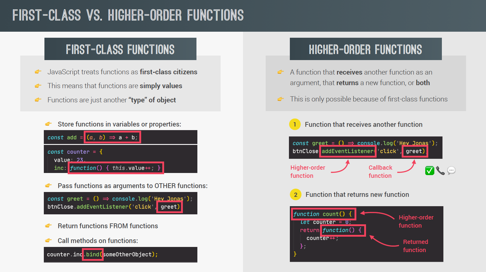

### **<font color=orangered> Closures </font>**

En relación a los closures es importante tener en cuenta que la función recordará todas las variales del entorno o scope en donde fue declarada, incluso aunque el entorno de ejecusion ya haya desaparecido del Call Stack.

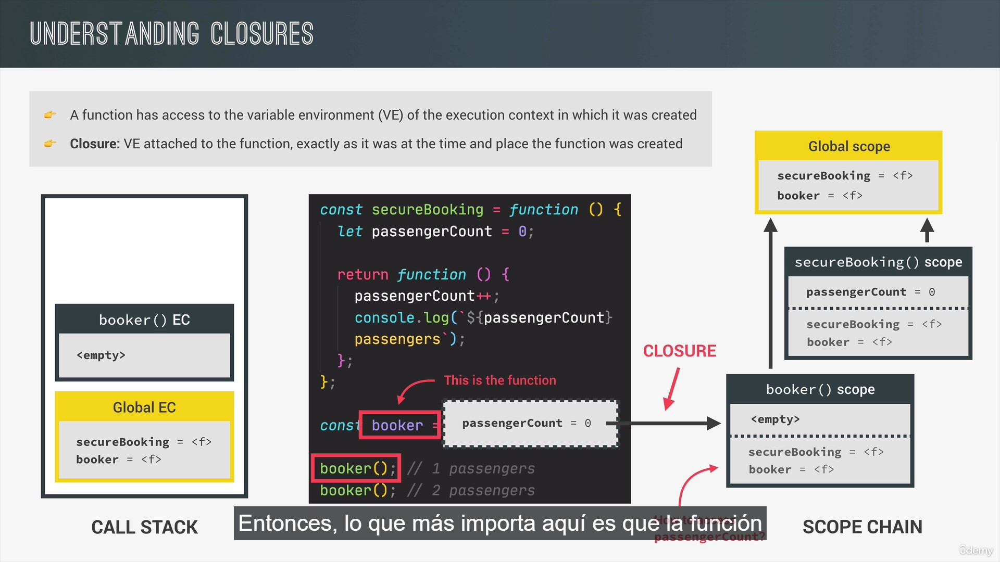

### **<font color=orangered> Immediately Invoked Function Expression (IIFE) </font>**

Is a JavaScript function that runs as soon as it is defined

```JS
let result = (function () {
    const name = "Barry"; 
    return name; 
})(); 
// Immediately creates the output: 
result; // "Barry"
```
